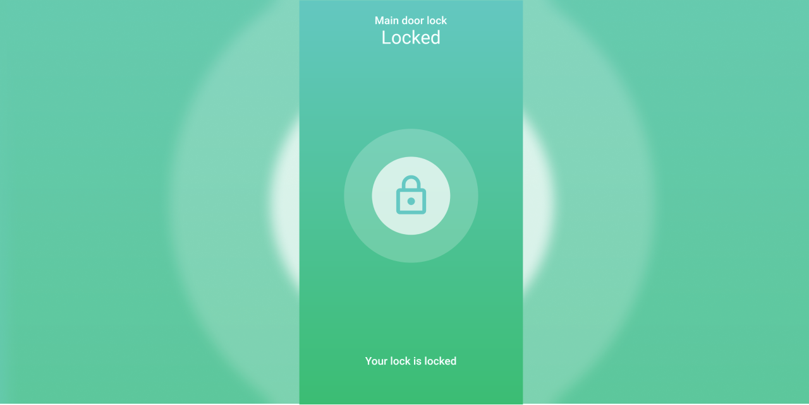

<div style="display: flex; justify-content: space-between; align-items: center;">
    <div style="box-sizing: border-box; width: 100%">
    
    </div>
    <div style="box-sizing: border-box; width: 100%">
    
    </div>
</div>


## Table of contents
* [General info](#door-lock)
* [Illustrations](#illustrations)
* [Technologies](#technologies)
* [Dependencies](#dependencies)
* [Setup](#setup)
* [Note](#note)

# Illustrations



# Door Lock

A HTTP based request to unlock the door using Flutter/Dart

## Technologies
Project is created with:
* Flutter: `3.7.0`
* Dart: `2.19.0`

### Dependencies
To run this project, to run you need those dependencies
* http: `^0.13.5`
* flutter_svg: `^1.1.6`
* http_auth: `^1.0.1`
* http_parser: `^4.0.2`


## Setup
To run this project, install it locally using flutter:

in `Dahua-Door-Lock-Flutter/lib/main.dart` make sure :
* to set your username and passowrd to access webserver `line 66`.
* to set your web server ip address `line 68`.
```
$ cd ../Dahua-Door-Lock-Flutter
$ flutter pub get
$ flutter run
```

## Note

This code work only on local **WIFI Network**.

